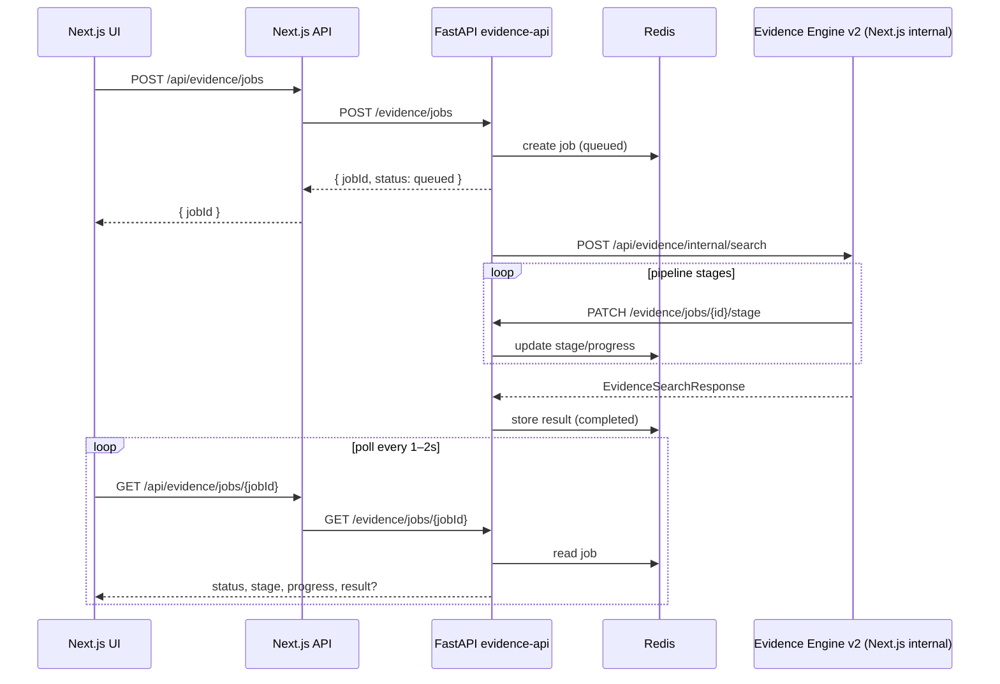

# Evidence jobs (async search)

Parliavent runs evidence search asynchronously via a FastAPI worker backed by Redis. The Next.js app keeps Evidence Engine v2 in TypeScript; FastAPI orchestrates jobs and stores status/results in Redis.

## Architecture



### Components

| Component | Role |
|-----------|------|
| **Next.js UI** | Starts jobs, polls status, renders sources (no auto-attach) |
| **Next.js `/api/evidence/jobs`** | Proxy to FastAPI |
| **Next.js `/api/evidence/internal/search`** | Protected route that runs Evidence Engine v2 |
| **Next.js `/api/evidence/search`** | Sync fallback (unchanged) |
| **FastAPI `services/evidence-api`** | Job queue, Redis state, background worker |
| **Redis** | Job status, stage, progress, result, dedupe keys |

### Option A (current)

Evidence Engine v2 stays in TypeScript. FastAPI does **not** reimplement the pipeline. The worker calls the internal Next.js route and receives an `EvidenceSearchResponse`-compatible JSON payload.

## Environment variables

### Next.js (`frontend/.env.local`)

```env
# Existing
TAVILY_API_KEY=...
GROQ_API_KEY=...
GROQ_MODEL=llama-3.3-70b-versatile

# Async evidence jobs
FASTAPI_EVIDENCE_URL=http://localhost:8000
EVIDENCE_INTERNAL_SECRET=change-me-to-a-long-random-string
```

### FastAPI (`services/evidence-api/.env`)

```env
REDIS_URL=redis://localhost:6379/0
NEXTJS_BASE_URL=http://localhost:3000
EVIDENCE_INTERNAL_SECRET=change-me-to-a-long-random-string
```

`EVIDENCE_INTERNAL_SECRET` must match on both sides. It protects `/api/evidence/internal/search` and FastAPI stage updates.

If `FASTAPI_EVIDENCE_URL` is unset, the UI falls back to synchronous `POST /api/evidence/search`.

## Run Redis locally

**Docker (recommended):**

```bash
docker run --name parliavent-redis -p 6379:6379 -d redis:7-alpine
```

**Windows (WSL or native Redis):** use the same port `6379` and set `REDIS_URL=redis://localhost:6379/0`.

Verify:

```bash
redis-cli ping
# PONG
```

## Run FastAPI service

```bash
cd parliavent/services/evidence-api
python -m venv .venv

# Windows
.venv\Scripts\activate

pip install -r requirements.txt

# Copy env (match EVIDENCE_INTERNAL_SECRET with Next.js)
# REDIS_URL=redis://localhost:6379/0
# NEXTJS_BASE_URL=http://localhost:3000
# EVIDENCE_INTERNAL_SECRET=...

python -m app.main
```

Service listens on `http://localhost:8000`.

Health check: `GET http://localhost:8000/health`

## Run Next.js

```bash
cd parliavent/frontend
npm install
npm run dev
```

App: `http://localhost:3000`

Start order: **Redis → FastAPI → Next.js** (FastAPI calls Next.js for the pipeline).

## Job state in Redis

Each job is a Redis hash at `evidence:job:{jobId}`:

| Field | Description |
|-------|-------------|
| `status` | `queued`, `running`, `completed`, `failed` |
| `stage` | Pipeline stage (see below) |
| `progress` | 0–100 |
| `result` | JSON string of `EvidenceSearchResponse` when completed |
| `error` | Error message when failed |
| `claim`, `threadId`, … | Request metadata |

Dedupe key: `evidence:dedupe:{cacheKey}` → `jobId` (same claim + thread + engine version). Reuses an in-flight or completed job within TTL (30 minutes).

### Stages and progress

| Stage | Progress | UI copy |
|-------|----------|---------|
| `queued` | 0 | Preparing evidence search... |
| `searching` | 15 | Searching for sources... |
| `fetching_pages` | 35 | Reading source pages... |
| `extracting_passages` | 55 | Extracting relevant text... |
| `ranking_passages` | 75 | Ranking evidence passages... |
| `verifying` | 90 | Checking whether sources support the claim... |
| `completed` | 100 | Evidence review complete. |
| `failed` | 100 | Evidence search failed. |

## Frontend polling

1. User clicks **Find sources** on a claim finding.
2. UI calls `fetchEvidenceSearchWithJob()` → `POST /api/evidence/jobs`.
3. Polls `GET /api/evidence/jobs/{jobId}` every **1.5s**.
4. Updates button label with stage copy while `status` is `queued` or `running`.
5. On `completed`, passes `result` to `onSourceSearchResult` (same as before).
6. On `failed`, shows calm error + **Try again** (does not auto-attach).

Sources are **never** attached automatically; user must click **Use source** on a candidate.

## Fallback to sync search

If `POST /api/evidence/jobs` fails (e.g. `FASTAPI_EVIDENCE_URL` unset or FastAPI down), `fetchEvidenceSearchWithJob` logs a warning and calls `POST /api/evidence/search` directly — the original synchronous path.

The sync route and in-memory evidence cache are unchanged. Evidence evals (`npm run eval:evidence`) still call `searchEvidence` directly and do not require Redis/FastAPI.

## Manual test claims

Use the composer with arguments that trigger these claim findings, then **Find sources**:

1. **Mobile phones cause cancer** — expect unsupported/contradicted; no attachable supporting sources.
2. **Studies prove congestion pricing always cuts emissions by 40% within one year** — expect unsupported/too_broad; no attachable support.
3. **Paris has expanded low-traffic and pedestrian-friendly zones in recent years** — expect supported/partially_supported; at least one attachable source.

Confirm in UI:

- Stage messages advance during the job.
- Source list appears only after completion.
- Status stays **open** until you click **Use source**.
- Published post has no citation until explicit attach.

## Confirm no auto-attach

After **Find sources** completes:

- Finding `status` remains `open` (not `source_attached`).
- `EvidenceCandidatesList` shows **Use source** per candidate.
- Only `onAttachEvidenceSource` (user click) sets `source_attached` and adds citations.

Run evidence evals (no jobs required):

```bash
cd parliavent/frontend
npm run eval:evidence
```
